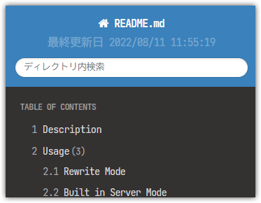
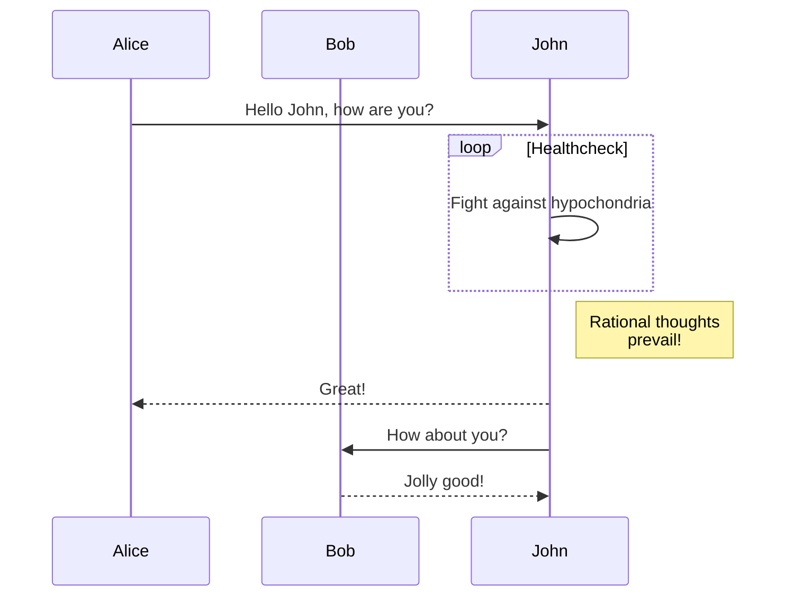
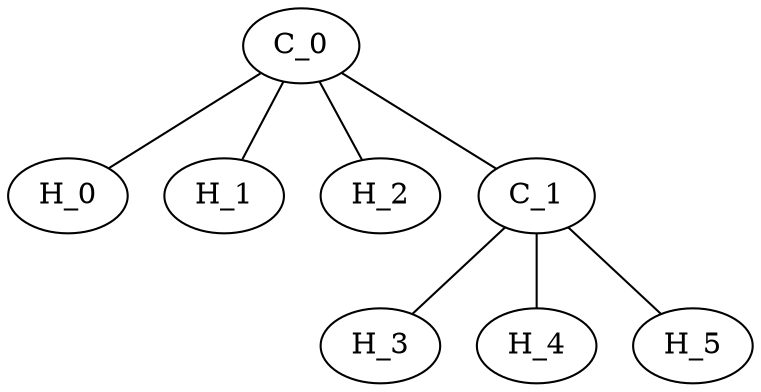

Markdown viewer for web
====
This is sub header
---

## Description

markdown を良い感じに表示する phar です。
ざっくり言えば要するに docsify の php 版のようなものです。

デザインは Read The Docs のものを使用しています。

- [Demo](https://arima-ryunosuke.github.io/php-htmarkdown/README.html)

## Usage

下記の3つの使い方があります。
いずれも `.md` `.php.md` の拡張子を対象にナビゲーションリンクが生成されます。
さらに `.php.md` の場合は php が実行されます。

### Rewrite Mode

下記のように web サーバを設定します。

[apache]{
```plaintext
RewriteRule \.md$ htmarkdown.phar [QSA,L]
```
}
[nginx]{
```plaintext
rewrite \.md$ htmarkdown.phar;
```
}

説明はほぼ不要ですが、拡張子 md を rewrite して phar に委譲されるようにします。
`-d` オプションを加えれば Directory Index としても機能します。

※ 環境によっては `security.limit_extensions` や `SetHandler` 等の設定が必要です

### Built in Server Mode

下記のようにして built in server で起動します。

```bash
php -S 0.0.0.0:8000 htmarkdown.phar
```

これも説明は不要でしょう。通常の built in server です。
phar がルーターの役割も持っているので、起動したカレントディレクトリ（もちろん `-t` も有効です）をドキュメントルートとして web サーバが起動します。

docsify の使い方に近いです。

### Command Line Mode

下記のように引数を渡すと引数が zip に変換されます。

```bash
php htmarkdown.phar /path/to/markdown.md > /path/to/markdown.html
```

出力は標準出力です。なので上記のようにリダイレクトは必須です。

第2引数にディレクトリを渡すとエクスポートされます。

```bash
php htmarkdown.phar /path/to/markdown.md /path/to/directory
```

ただし、この機能は現時点ではおまけです。
この機能は後述の semver の互換性保持には含まれません。

## Feature

基本的には機能決め打ちのただの markdown viewer です。

- parent, sibling, children のような周辺リンクの生成機能
- 自身以下からの検索機能
- ダウンロード機能
- 一部の設定の画面操作

などがありますが、おまけです。
ドキュメントルートに配置して、 markdown を踏んだときにそれらしく見やすくするのが主目的です。

### 拡張構文

標準の markdown に加えて下記の拡張構文があります。

#### マーカー

`==マーカー文字==` とするとマーカーが引かれます。

```markdown:マーカー
これは==マーカー==文字です。
```

上記のようにすると下記のようになります。

これは==マーカー==文字です。

#### バッジ

`{タイプ:タイトル|テキスト}` とするとバッジになります。

```markdown:バッジの例
- 単純なバッジ {this is badge}
- success バッジ {success:テキスト}
- タイトル付きalert バッジ {alert:タイトル|テキスト}
```

上記のようにすると下記のようになります。

- 単純なバッジ {this is badge}
- success バッジ {success:テキスト}
- タイトル付きalert バッジ {alert:タイトル|テキスト}

上記のようにタイプ,タイトル,テキストはある程度省略できます。
タイプは `info` `success` `notice` `alert` が使えます。

#### キャプション

ヘッダーのように `####### Caption` と `#` を7個並べるとキャプションになります。

```markdown:キャプション
####### This Is Caption

内容
```

上記のようにすると下記のようになります。

####### This Is Caption

内容

キャプションはブロック要素となり `p` で囲われません。さらに見出しとして検出されません。
実態は `em` ですが、変更される可能性があります。
また、意図的に下部パディングを小さめにしています。

セクション内のちょっとした区切りやアクセントとして使用します。

#### 拡張リンク

通常のリンク記法（`[text](url)`）に加えて属性が指定可能です。
画像記法（``）にも適用されます。

```markdown:拡張リンク
これは[普通のリンク](https://example.com)です。
これは[別タブで開くリンク](https://example.com target=_blank)です。
これは[id, class が指定されたリンク](https://example.com id="link" class="c1 c2")です。

これはwidth指定された画像です。
```

上記のようにすると下記のようになります。

これは[普通のリンク](https://example.com)です。
これは[別タブで開くリンク](https://example.com target=_blank)です。
これは[id, class が指定されたリンク](https://example.com id="link" class="c1 c2")です。

これはwidth指定された画像です。

#### コメント

`//` で html コメントになります。

```markdown:html コメント
この下にコメントがあります。
// これは html コメントです
この上にコメントがあります。
```

上記のようにすると下記のようになります。

この下にコメントがあります。
// これは html コメントです
この上にコメントがあります。


#### ノート

コードブロックと同じように `:::` で囲むと注意書きブロックが生成されます。

```markdown:注意書きの例
:::note:title
これは注意書きです。
:::
```

上記のようにすると下記のようになります。

:::note:title
これは注意書きです。
:::

`note` の部分は Read The Docs の他のタイプが使えます。頻出するのは `hint` `info` `warning` `important` などでしょう。

title の部分はただのラベルになります。

歴史的な経緯により、 `"""` でもノート記法が使えますが、主流は `:::` なので `:::` を使うようにしてください。

#### サイドバー

コードブロックと同じように `///` で囲むとサイドバーブロックが生成されます。

```markdown:サイドバーの例
///note:title
これはサイドバーです。
///
```

上記のようにすると下記のようになります。

///note:title
これはサイドバーです。
///

note の部分はほぼ飾りです。 Read The Docs 本家にスタイルがなかったため、埋め込まれはしますがスタイルは変わりません。
title の部分はただのラベルになります。

ただし `right` を指定した場合のみ無装飾で右上に配置されます。

```markdown:right
///right
これは右側に配置されます。
///
```

///right
これは右側に配置されます。
///

#### ツリーリスト

`+` でリスト記法を記述すると木構造になります。

```markdown:木構造
####### root

+ directory1
    + file1A
    + file1B
    + directory11
        + file11A
    + directory12
        - file12A
    - normal items
        - item1
        - item2
+ directory2
    + file2A

// くっつき防止

+ root
    + item1
        + item2
```

上記のようにすると下記のようになります。

####### root

+ directory1
    + file1A
    + file1B
    + directory11
        + file11A
    + directory12
        + file12A
    - normal items
        - item1
        - item2
+ directory2
    + file2A

// くっつき防止

+ root
    + item1
        + item2

すべてが葉要素になるため、1つ目はキャプション記法を利用してルートっぽくなるようにしています。
ただし、2つ目のように最上位のアイテムが1つの場合はその項目だけ縦線は引かれません。

また、ツリー内はすべて `+` で記述する必要があります。
逆に言えば `+` を使わなければ normal items のように通常リストを混在させることも可能です。
単に「`+` を使うとちょっと変わった list-style になる」と言った方が分かりやすいかもしれません。

#### 定義リスト

`-` や `*` などのリスト記法に続けて、`: `（コロンスペース）があると定義リストが生成されます。

```markdown:横並び定義リストの例
- りんご: 赤いです
- みかん: 黄色いです
```

上記のようにすると下記のようになります。

- りんご: 赤いです
- みかん: 黄色いです

コロンの直後に改行すると横並びではなくスタンダードな定義リストになります。

```markdown:縦並び定義リストの例
- りんご:
赤いです
美味しいです
- みかん:
黄色いです
酸っぱいです
```

上記のようにすると下記のようになります。

- りんご:
赤いです
美味しいです
- みかん:
黄色いです
酸っぱいです

コロンの直後にスペースを含めて改行すると横並びで詳細を記載する機会が与えられます。
つまり、定義リストのネストや他の記法が使えることになります。

````markdown:横並びネスト定義リストの例
- 果物: 
    - りんご: これはネストされた箇条書きリストです
        - 赤いです
        - 美味しいです
    - みかん: これはネストされた定義リストです
        - 色: 黄色
        - 季節: 冬
    - いちご: 
    ```php
    // これはネスト中のコードブロックです
    echo 1;
    echo 2;
    ```
````

上記のようにすると下記のようになります。

- 果物: 
    - りんご: これはネストされた箇条書きリストです
        - 赤いです
        - 美味しいです
    - みかん: これはネストされた定義リストです
        - 色: 黄色
        - 季節: 冬
    - いちご: 
    ```php
    // これはネスト中のコードブロックです
    echo 1;
    echo 2;
    ```

標準 markdown にはなぜか定義リストがなく、結構不便なので独自に定義しています。
上記の通り、他のあらゆる記法とは全く異なる独自ルールです。

そもそも定義リストは**リスト**ですし、もともと markdown は「そのままのテキストでもそれっぽく見える」ような記法だったはずです。
ので見た目（md）とマークアップ（html）があまり剥離しないこのルールは割と好きです。

:::warning:注意
コロンスペースのスペースは必須です。でないと下記のような「URL のリスト」が定義リストと認識されてしまいます。

- http://example.com/hoge
- http://example.com/fuga

※ スペースを必須にしないとただのリストのつもりが、下記のようになってしまう

- http: //example.com/hoge
- http: //example.com/fuga
:::

#### 折りたたみ

コードブロックと同じように `...` で囲むと折りたたみとなります。

```
...ここは **summary** になります
ここが折りたたみの中身になります
...
```

上記のようにすると下記のようになります。

...ここは **summary** になります
ここが折りたたみの中身になります
...

summary 部分を省略すると summary タグは生成されません。
その場合ブラウザのデフォルトになります（「省略」など）。

#### タブ

`[タブ名]{タブ内容}` とするとタブ表示になります。

````
[これはタブAです]{
これは内容です
}
[これはタブBです]{
- markdown 構文も
- 使えます

```
これはコードブロックです
```
}
````

上記のようにすると下記のようになります。

[これはタブAです]{
これは内容です
}
[これはタブBです]{
- markdown 構文も
- 使えます

```
これはコードブロックです
```
}

タブ内容に改行は必須です。 `[タブ名]{タブ内容}` のように1行で記述することはできません。
各タブ間に空行を挟んではいけません。挟むとそれぞれ別のタブブロックと認識されます。

#### 幅指定テーブル

テーブル記法で2行目に空白を含めると `-` の数が列の幅になります。

```markdown:幅指定テーブルの例
| 連番 | 名前 | 日付                |
|----: |:-----|:---:                |
|    1 | Hoge | 2014/12/24 12:34:56 |
|    2 | Fuga | 2015/12/24 12:34:56 |
|    3 | Piyo | 2014/12/24 12:34:56 |
```

上記のようにすると下記のようになります。

| 連番 | 名前 | 日付                |
|----: |:-----|:------------------: |
|    1 | Hoge | 2014/12/24 12:34:56 |
|    2 | Fuga | 2015/12/24 12:34:56 |
|    3 | Piyo | 2014/12/24 12:34:56 |

「連番」の幅が狭く、「日付」の幅が広くなっています。
「名前」は空白が含まれていないので width が指定されていません。

値としては「列のハイフンの数 / 全体ハイフンの数 * 100」% が指定されます。
要するにハイフンの数の全体を占める割合になります。

このとき、table に `table-layout: fixed; word-break: break-all;` が設定されます。

#### 罫線なしテーブル

テーブル記法で両端の `|` を省略すると縦罫線のないテーブルになります。

```markdown:罫線なしテーブルの例
 連番 | 名前 | 日付               
-----:|:-----|:------------------:
    1 | Hoge | 2014/12/24 12:34:56
    2 | Fuga | 2015/12/24 12:34:56
    3 | Piyo | 2014/12/24 12:34:56
```

上記のようにすると下記のようになります。

 連番 | 名前 | 日付               
-----:|:-----|:------------------:
    1 | Hoge | 2014/12/24 12:34:56
    2 | Fuga | 2015/12/24 12:34:56
    3 | Piyo | 2014/12/24 12:34:56

生成される html はほぼ変わりません。 table に `no-border` が付くか付かないかです。表示は css が担っています。
現在のところ、縦罫線に加えて背景色も消えます。これはリスティングを主目的としているため（＋作者が stripe が嫌いなため）です。

#### ヘッダなしテーブル

テーブル記法ですべてのヘッダを空白にするとヘッダなしのテーブルになります。

```markdown:ヘッダなしテーブルの例
|      |      |                     |
|-----:|:-----|:-------------------:|
|    1 | Hoge | 2014/12/24 12:34:56 |
|    2 | Fuga | 2015/12/24 12:34:56 |
|    3 | Piyo | 2014/12/24 12:34:56 |
```

上記のようにすると下記のようになります。

|      |      |                     |
|-----:|:-----|:-------------------:|
|    1 | Hoge | 2014/12/24 12:34:56 |
|    2 | Fuga | 2015/12/24 12:34:56 |
|    3 | Piyo | 2014/12/24 12:34:56 |

現在のところ、「空でも良いのでヘッダを出したい」という動作はありません。

#### キャプションつきテーブル

テーブル記法の上下に `:キャプション:` があるとそれは caption になります。
上にある場合は上側、下にある場合は下側に配置されます。

```markdown:キャプションつきテーブルの例
:これは左上 caption です
| 連番 | 名前 | 日付                |
|-----:|:-----|:-------------------:|
|    1 | Hoge | 2014/12/24 12:34:56 |
|    2 | Fuga | 2015/12/24 12:34:56 |
|    3 | Piyo | 2014/12/24 12:34:56 |

| 連番 | 名前 | 日付                |
|-----:|:-----|:-------------------:|
|    1 | Hoge | 2014/12/24 12:34:56 |
|    2 | Fuga | 2015/12/24 12:34:56 |
|    3 | Piyo | 2014/12/24 12:34:56 |
これは右下 caption です:

:これは中央上 caption です:
| 連番 | 名前 | 日付                |
|-----:|:-----|:-------------------:|
|    1 | Hoge | 2014/12/24 12:34:56 |
|    2 | Fuga | 2015/12/24 12:34:56 |
|    3 | Piyo | 2014/12/24 12:34:56 |
:これは中央下 caption です:
```

上記のようにすると下記のようになります。

:これは左上 caption です
| 連番 | 名前 | 日付                |
|-----:|:-----|:-------------------:|
|    1 | Hoge | 2014/12/24 12:34:56 |
|    2 | Fuga | 2015/12/24 12:34:56 |
|    3 | Piyo | 2014/12/24 12:34:56 |

| 連番 | 名前 | 日付                |
|-----:|:-----|:-------------------:|
|    1 | Hoge | 2014/12/24 12:34:56 |
|    2 | Fuga | 2015/12/24 12:34:56 |
|    3 | Piyo | 2014/12/24 12:34:56 |
これは右下 caption です:

:これは中央上 caption です:
| 連番 | 名前 | 日付                |
|-----:|:-----|:-------------------:|
|    1 | Hoge | 2014/12/24 12:34:56 |
|    2 | Fuga | 2015/12/24 12:34:56 |
|    3 | Piyo | 2014/12/24 12:34:56 |
:これは中央下 caption です:

左右・中央の指定は2行目と同じルールですが、 `:` を省略することはできません。

#### ヒアドキュメント

コードブロックと同じように `<<<` で囲むとヒアドキュメントとなります。

```markdown:ヒアドキュメントの例
<<<
これはヒアドキュメントです。
この中では**一切の markdown 記法や html は無効**になります。

- A
- B
- C

<strong>strong</strong>
<<<
```

上記のようにすると下記のようになります。

<<<
これはヒアドキュメントです。
この中では**一切の markdown 記法や html は無効**になります。

- A
- B
- C

<strong>strong</strong>
<<<

コードブロックと似ていますが、シンタックスハイライトはされません。
あくまで、「マークダウンのエスケープが不要なヒアドキュメント」となります。
使う機会はそう多くないでしょう。

#### 絶対配置

コードブロックと同じように `^^^` で囲むと絶対配置（position:absolute）になります。

ブロック内で `(x,y:content)` を記述すると相対座標 (x,y) に content を配置できます。
content を n あるいは数字にすると丸数字になります。
n の場合は数値は自動増加します。数字にするとその数値から始まり、内部的なグループが変更されます。

さらに `(x,y,w,h)` を記述するとその座標（相対）に矩形を配置できます。

基本的に画像への注釈のような使い方を想定しています。

```markdown:絶対配置の例
^^^

              (n)
     (n)
(11)


(n)
  (21)                 (0,12:これは plain text です)

(56,16,128,26)
^^^



| No  | 名称     | 説明
|----:|:---------|:-----
| 1   | 文書名   | 文書名です
| 2   | 更新日時 | 更新日時です
| 11  | 検索     | 文書内を検索します
| 12  | 目次     | テーブルオブコンテンツです
| 21  | ヘッダー | ヘッダー名です
```

上記のようにすると下記のようになります。

^^^

              (n)
     (n)
(11)


(n)
  (21)                 (0,12:これは plain text です)

(56,16,128,26)
^^^


| No  | 名称     | 説明
|----:|:---------|:-----
| 1   | 文書名   | 文書名です
| 2   | 更新日時 | 更新日時です
| 11  | 検索     | 文書内を検索します
| 12  | 目次     | テーブルオブコンテンツです
| 21  | ヘッダー | ヘッダー名です

絶対配置内は pre 表示されるため、文字・行ベースで位置を合わせ、次の要素（img）と重ね合わせることで実現します。よほどの微調整が要求されない限りそれで十分です。
微調整が要求されたら `(0,-7:n)` のようにy座標を調整します。

かなりニッチな機能で、作者が必要に迫られて実装したものです。
この記法は後方互換性に含まれません。

#### mermaid

コードブロックで mermaid を明示すると mermaid 記法になります。

````markdown:mermaid の例

````

上記のようにすると下記のようになります。


単に mermaid.js を呼んでいるだけであり、特別なことはしていません。

#### graphviz

コードブロックで dot を明示すると dot 記法になります。

````markdown:dot の例

````

上記のようにすると下記のようになります。


単に Viz.js を呼んでいるだけであり、特別なことはしていません。

#### div ブロック

`--` で囲むと div ブロックとなります。

```markdown:divブロック
--
この中は div で囲まれています。
--

--section#thisisid.thisisclass[attr=value]{color:red;background:#eee}
この中は section で囲まれています。
--
```

上記のようにすると下記のようになります。

--
この中は div で囲まれています。
--

--section#thisisid.thisisclass[attr=value]{color:red;background:#eee}
この中は section で囲まれています。
--

見ての通り css 記法を使用して id, class, 属性, スタイルを個別に当てることも可能です。
何も指定しなかった場合、`div.block` になります。

#### 属性

`[attr=value]` のようにセレクタライクな記法で直後のノードに属性を振ることができます。
さらに `{color:red}` のように中括弧で囲むとスタイル属性となります。
直後にテキストノード以外のノードが存在しない場合は親ノードに適用されます。

この記法だけは特別扱いされており、ブロック記法の直前に空行なしで記述してもブロック構造が壊れたりしません。

```markdown:属性
[target=_blank][このリンクは target=_blank が指定されています](https://example.com)
[hoge=hoge fuga=fuga piyo=piyo]**この太字は hoge fuga piyo が指定されています**
[id=hoge]{color:red}`このインラインコードは id が指定されてスタイルが効いています`

- {color:red}li自体にスタイルが適用されています

[class=" hint"]
:::
このノートは .hint が付与されています。
:::
```

上記のようにすると下記のようになります。

[target=_blank][このリンクは target=_blank が指定されています](https://example.com)
[hoge=hoge fuga=fuga piyo=piyo]**この太字は hoge fuga piyo が指定されています**
[id=hoge]{color:red}`このインラインコードは id が指定されてスタイルが効いています`

- {color:red}li自体にスタイルが適用されています

[class=" hint"]
:::
このノートは .hint が付与されています。
:::

class 属性だけは特別扱いされており、先頭が空白だと追加を意味します。
空白がないと class 属性自体も完全に置換されます。

例えば下記の1つ目は `+` を使用しているのにツリー構造になりません。
2つ目のように空白で始めて「追加である」ことを明示する必要があります。

```markdown:属性
[class=hoge]
+ A
+ B

[class=" hoge"]
+ A
+ B
```

[class=hoge]
+ A
+ B

[class=" hoge"]
+ A
+ B

#### 参照ブロック

`<<` でラベルをつけると後から参照できるブロックを定義できます。

```
<<BLOCK1
ここは BLOCK1 です。

:::note:title
test
:::
BLOCK1

<<BLOCK2
ここは BLOCK2 です。

$BLOCK1
BLOCK2

<<BLOCK3
...ここは BLOCK3 です
$BLOCK1
$BLOCK2
$BLOCK3
...
BLOCK3

- BLOCK1: $BLOCK1
- BLOCK2: $BLOCK2
- BLOCK3: $BLOCK3
```

上記のようにすると下記のようになります。

<<BLOCK1
ここは BLOCK1 です。

:::note:title
test
:::
BLOCK1

<<BLOCK2
ここは BLOCK2 です。

$BLOCK1
BLOCK2

<<BLOCK3
...ここは BLOCK3 です
$BLOCK1
$BLOCK2
$BLOCK3
...
BLOCK3

- BLOCK1: $BLOCK1
- BLOCK2: $BLOCK2
- BLOCK3: $BLOCK3

定義されたブロックは表示されません。
その代わり `$blockName` で参照することでその箇所に埋め込むことができます。

定義ブロック内でブロックを参照することもできます（上記の BLOCK2）。
ただし循環参照があると打ち切られてブロックが埋め込まれません（上記の BLOCK3）。

識別子に使える文字は `[_a-zA-Z][_a-zA-Z0-9]*` です。大文字小文字を区別します。

リストやテーブル内にブロックを埋め込む場合、書式が非常にややこしくなってしまいますが、この方法を使うとベタ書き感覚でブロックを埋め込むことができます。

## License

MIT

## Release

バージョニングはセマンティックバージョンに準拠します。
が、内部的な php のコードは準拠しません。
semver 準拠はあくまで下記だけです。

- phar としてのインターフェース
- 拡張構文の互換性

つまり、内部設計・デザイン・レンダリング結果は互換性を維持しません。
例えば「コントールパネルから設定できる項目」「親兄弟のナビゲーション」「テキスト検索」などの機能面は予告なく追加・廃止されることがあります。
また、 Read The Docs のテーマではなく、他のものにガラリと変わることもありえます。

逆に言えば「phar の引数が変更になった」「markdown の拡張構文を廃止した」などは互換性の破壊となり、 semver 準拠（メジャーアップ）となります。

今のところ phar に引数はありませんが、「POST で markdown を編集できる」のようなオプションが増えることが想定されます。

### x.y.z

- POST で更新する？
- 静的ファイルは全部 CDN に逃したい
- markdown に include 機能を持たせたい

### 1.5.0

- [fixbug] 拡張子周りを修正
- [feature] デフォルトオプションを指定できる機能
- [feature] ノート記法に ::: を追加
- [feature] summary はタグそのものなので markdown が活きるように変更
- [feature] タブ機能を実装
- [feature] yaml によるメタデータ埋め込みを実装

### 1.4.0

- [change] 一部のデフォルトオプションを変更
- [change] アウトラインクリック時に hashchange を発火させる
- [feature] コンパネの保存パスを指定可能にする設定

### 1.3.0

- [feature] ディレクトリの不可視を部分的に対応
- [feature] 変更のないファイルをスキップする機能
- [feature] 静的ファイルを共通で吐き出す機能
- [feature] sort_order オプションを追加

### 1.2.5

- [fixbug] メニューがなくなったときのコンパネの表示を修正
- [feature] メニューサイズのドラッグ対応

### 1.2.4

- [change] デザイン調整
- [feature] graphviz 対応

### 1.2.3

- ビルド漏れ

### 1.2.2

- [change] 見出しの色を変更
- [feature] 同レベル見出しをすべて表示するオプションを新設
- [fixbug] 要約の内容が空になったり結合してしまったりする不具合を修正
- [fixbug] バックスラッシュが改行になってしまう不具合を修正
- [fixbug] 印刷時に dl dd が隠れてしまう不具合を修正
- [change] mermaid のバージョンアップ

### 1.2.1

- [feature] リンクの属性対応
- [change] 改行の扱いを変更

### 1.2.0

- [change] デザイン変更
- [change] 出力ディレクトリ指定機能
- [feature] 擬似的な docroot である navroot を追加
- [change] インデックスでファイル名だけでなくタイトルも表示
- [refactor] キャッシュの変更
- [change] soft_limit の撤廃
- [feature] 絶対配置ブロック
- [feature] divブロックと属性指示子
- [feature] 参照ブロック
- [feature] テーブル記法の拡張
- [feature] + でのツリーリスト構文
- [feature] コメント機能
- [fixbug] コードブロックのスペース以降のラベルが消失していた不具合を修正
- [refactor] コード修正
- [feature] コードブロックの行番号表示
- [feature] フォントサイズ変更機能
- [feature] 子セクションの要素数を表示
- [feature] 自動非表示機能で隠れている要素数を表示
- [feature] 見出しの sticky 機能
- [feature] 見出し番号の表示を head/body に分離

### 1.1.3

- [change] デザイン調整
- [feature] 見出しの表示切替機能
- 対応バージョンを 7.4 に格上げ

### 1.1.2

- [fixbug] エクスポート時に出ていたエラーを修正
- [change] main,sub ヘッダーはセクションとみなさない
- [change] デザイン調整
- [feature] フォントの指定機能
- [feature] mermaid.js 対応

### 1.1.1

- [feature] カスタム js/css 機能
- [feature] エクスポート機能
- [refactor] 仕様のシンプル化と軽微変更
- [feature] ディレクトリインデックスファイル名を指定できるように修正
- [feature] 拡張子なしファイルで .md が存在する場合は読み替える
- [feature] 単一ファイルで検索されたときは親ディレクトリを対象とする
- [fixbug] クエリ文字のエスケープが行われていなかったので修正
- [fixbug] Parsedown のオプションが効いていなかった不具合を修正
- [fixbug] 検索結果が大文字小文字の違いでハイライトされない不具合を修正
- [refactor] 気になる箇所を修正
- [change] 自動開閉は単純に表示領域の前後とする
- [change] ブロックインデントを中身だけに変更
- [feature] 開閉ボタンを実装

### 1.1.0

- [feature] 二重拡張子が php の場合は include する機能
- [feature] スクロール同期の遅延を解消
- [feature] アクティブな見出しは隠していても表示される機能
- [feature] right sidebar を実装
- [feature] キャプション記法を実装
- [feature] バッジ記法を実装
- [feature] マーカー記法を実装
- [feature] ToC のサイズ変更機能
- [fixbug] 言語設定が効いていない不具合を修正
- [fixbug] スペルミスでデフォルト値が効いていない不具合を修正

### 1.0.0

- 公開
